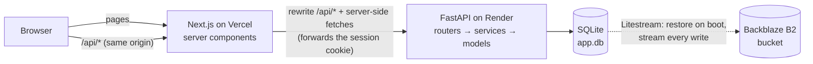
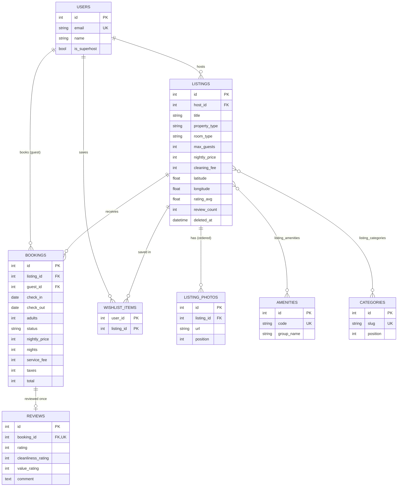

# Airbnb Clone

A full-stack Airbnb-style stays marketplace. Guests search, filter, save, book, cancel and review stays. Hosts create, edit and delete listings and see their reservations. Built for the Scalar AI Lab round 2 assignment.

| | |
|---|---|
| **Frontend** | Next.js 16 (App Router, React 19, TypeScript, Tailwind CSS 4), on Vercel |
| **Backend** | FastAPI + SQLAlchemy 2 + Pydantic 2, on Render |
| **Database** | SQLite, with foreign keys, CHECK constraints and an overlap trigger |
| **Live demo** | Frontend: [anbindia.vercel.app](https://anbindia.vercel.app/) · API docs: [airbnb-clone-api-529x.onrender.com/docs](https://airbnb-clone-api-529x.onrender.com/docs) |

> The backend runs on Render's free plan, which sleeps when idle. A scheduled GitHub Action pings it every 10 minutes to keep it awake. If it has still gone to sleep, the first request can take up to a minute; if a page shows "Something went wrong", click **Try again**.

---

## Evaluator walkthrough (about 5 minutes)

Log in from the profile menu (top right) or any "Log in" prompt. Authentication is mocked: pick a demo account, no password needed.

| Account | Email | What to try |
|---|---|---|
| **Demo Guest**: Ananya Sharma | `ananya@example.com` | Search, wishlist, book, cancel, review. She has upcoming and past trips. |
| **Demo Host**: Rahul Mehta, Superhost | `rahul@example.com` | Host dashboard, reservations, and create, edit or delete a listing. He owns 8 listings. |

The other seeded users can log in by email too: hosts `priya@`, `arjun@`, `meera@`, `kabir@` and `sofia@`, and guests such as `vikram@` and `neha@` (all `@example.com`).

**As the guest:**
1. **Home.** Click a category chip (Beachfront, Cabins, …) to filter the grid. Hover a card to page through its photos, then tap ♥ to save it.
2. **Search.** Open the big search bar and pick *Where*, dates on the two-month calendar, and a guest count. On the results page:
   - Try the quick amenity chips, the sort menu and **Filters**. Filters covers price range, type of place, rooms and beds, property types and amenities, and its "Show N places" count updates live.
   - The map beside the results shows a price pin for each home. Hovering a card highlights its pin, and clicking a pin opens a preview card. On phones, use **Show map**.
   - The URL holds the whole search, so reloading or sharing it keeps the results.
3. **Listing page.** You'll see:
   - A photo mosaic with a full photo tour.
   - Highlights, amenities, and an availability calendar where booked nights are struck through.
   - The review breakdown, a map and the host card.
   - The sticky reserve card, which prices the stay live: nights × rate, cleaning fee, 14% service fee and 12% taxes.
4. **Book.** **Reserve** leads to *Confirm and pay*. You can edit the dates and guests there, and payment is mocked. Confirming shows the trip with a confirmation code. The nights you booked are now blocked everywhere: the calendar, search results and the API.
5. **Trips.** The Upcoming, Past and Cancelled tabs. Cancel an upcoming trip, or **Write a review** on a past one. A review updates the listing's rating immediately.
6. **Wishlists.** Everything you saved.

**As the host:**

7. **Switch to hosting.** Use the profile menu. The dashboard shows stats and reservations: *currently hosting*, upcoming, past and cancelled.
8. **Listings.** Choose **Create listing** to run the step-by-step wizard with validation on every step. Photos come from demo URLs or any pasted image URL. Then **Edit** the listing or **Delete** it. Deleting is refused while the listing has upcoming bookings.

---

## Features

- **Discovery.** Category bar, destination search with suggestions, date range and guest count, and filters for price, room type, property type, bedrooms, beds, bathrooms and amenities. Sorting by recommended, price or rating. Pagination.
- **Search map.** A Leaflet map with OpenStreetMap tiles, a price pin per result (the stay total once dates are set), hover-linked cards and a preview card on click. It is a sticky panel on large screens and a full-screen toggle on phones.
- **Availability-aware search.** A listing appears only if it fits the party and is free for the whole stay. Back-to-back stays are allowed: checking out on the 5th doesn't block a check-in on the 5th.
- **Listing detail.** Photo mosaic and photo tour, description modal, amenities grouped by type, and a two-month availability calendar. Also reviews with a six-category breakdown and a "Guest favourite" badge, an OpenStreetMap embed, the host profile and house rules.
- **Booking.** A live server-side quote, a checkout page, a mocked payment, and a confirmation page. A stay can be cancelled until the day before check-in.
- **Double-booking prevention** at three levels (see below).
- **Trips.** Upcoming, Past and Cancelled tabs, trip detail, cancel, and one review per completed stay.
- **Wishlist.** Heart toggles save and unsave instantly, rolling back on errors; logged-out users are asked to log in and the save completes once they do.
- **Hosting.** Dashboard stats, reservations by phase, and a listing wizard for create and edit. Delete is a soft delete that keeps past trips intact and is refused while bookings are upcoming.
- **Responsive layout.** The large search bar on home and a compact search pill elsewhere. On phones: a full-screen search sheet, a bottom tab bar, and a sticky reserve bar on mobile listing pages. Dialogs open as bottom sheets on phones.
- **Accessibility.** Native `<dialog>` modals with focus handling, labelled icon buttons, keyboard-reachable calendars and steppers, and `role="radiogroup"` star inputs.

---

## Architecture



- **Same-origin API.** The browser only ever calls `/api/*` on the Vercel domain, and Next.js rewrites those calls to FastAPI. The session cookie is therefore first-party (`HttpOnly`, `SameSite=Lax`, `Secure` in production), with no CORS setup and no third-party-cookie problems.
- **Server-rendered pages.** Server components fetch from FastAPI directly and forward the visitor's cookie, so pages arrive with data. Client components handle the interactive parts: search, calendars, quotes, wishlist toggles and forms.
- **Backend layers.** Routers stay thin; services hold the business rules; SQLAlchemy models and DB constraints guard the data.
- **Errors.** Every error returns one envelope: `{"error": {"code", "message", "details?"}}`. The frontend maps validation `details` onto form fields.

### Data model



Design notes:
- **Reviews hang off bookings.** Only a guest who actually stayed can review, the `UNIQUE(booking_id)` constraint allows one review per stay, and the listing and author are reached through the booking.
- **Bookings store a price snapshot:** nightly price, nights, fees, taxes and total. Later price edits never change existing trips. A CHECK constraint enforces `total = nightly_price × nights + cleaning_fee + service_fee + taxes`.
- **Listings are soft-deleted** (`deleted_at`), so past trips and their reviews stay intact.
- **Rating cache.** `rating_avg` and `review_count` are a denormalised cache, recomputed whenever a review is written, so search results can sort by rating cheaply.
- **Money** is stored as whole rupees (integers). Percentages round half-up.

### Double-booking prevention

Stays are half-open ranges `[check_in, check_out)`. Two confirmed bookings conflict when `a.check_in < b.check_out AND b.check_in < a.check_out`. The rule is enforced at three levels:

1. **UI.** The calendars disable booked nights, and a check-out that would span a booked night.
2. **Service layer.** `POST /api/bookings` re-validates everything (dates, party size, availability) and returns `409 dates_unavailable` on a conflict.
3. **Database.** A SQLite `BEFORE INSERT` trigger aborts any overlapping confirmed booking. This catches two requests racing each other; the API turns the abort into the same 409.

### Pricing

```
subtotal    = nightly_price × nights
fee_base    = subtotal + cleaning_fee
service_fee = round_half_up(fee_base × 14%)
taxes       = round_half_up(fee_base × 12%)
total       = fee_base + service_fee + taxes
```

One function (`backend/app/services/pricing.py`) prices the live quote, the booking and the seed data, so they can never disagree. Stays run from 1 to 90 nights, and check-in can't be in the past. "Today" is the date in India (IST).

---

## API

All routes are under `/api`. Interactive docs are at `/docs` on the backend.

| Method | Path | Auth | Purpose |
|---|---|---|---|
| GET | `/health` | – | Liveness check |
| POST | `/auth/login` · `/auth/logout` | – | Mocked login by email; sets or clears the session cookie |
| GET | `/auth/me` | user | Current user |
| GET | `/categories` · `/amenities` · `/destinations` | – | Catalog data for the filters and search bar |
| GET | `/listings` | – | Search. Query params: `location, check_in, check_out, guests, category, min_price, max_price, room_type, property_types[], amenities[], min_bedrooms, min_beds, min_bathrooms, sort, page, page_size` |
| GET | `/listings/{id}` | – | Listing detail with photos, amenities and host |
| GET | `/listings/{id}/availability` | – | Booked ranges within a date window |
| GET | `/listings/{id}/quote` | – | Price for `check_in, check_out, adults, children`, after checking every booking rule |
| GET | `/listings/{id}/reviews` | – | Paginated reviews |
| POST | `/bookings` | user | Book (201), or 409 if the dates are taken |
| GET | `/bookings/mine` | user | My trips, optionally filtered by `phase=upcoming\|past\|cancelled` |
| GET | `/bookings/{id}` | guest or host | One trip |
| POST | `/bookings/{id}/cancel` | guest or host | Cancel an upcoming stay |
| POST | `/bookings/{id}/review` | guest | Review a completed stay (201), once |
| GET · PUT · DELETE | `/wishlist` · `/wishlist/{listing_id}` | user | List, save or unsave |
| GET · POST | `/host/listings` | user | My listings; create one (creating makes you a host) |
| PUT · DELETE | `/host/listings/{id}` | owner | Edit; soft delete, refused while upcoming bookings exist |
| GET | `/host/reservations` | user | Bookings on my listings, optionally filtered by `phase` |

---

## Running locally

Prerequisites: Python 3.11+ and Node.js 20+.

**Backend** (http://localhost:8000):

```bash
cd backend
python -m venv .venv
.venv/Scripts/activate      # Windows; on macOS/Linux: source .venv/bin/activate
pip install -r requirements-dev.txt
uvicorn app.main:create_app --factory --reload --port 8000
```

On first start the backend creates `backend/data/app.db` and seeds it with:
- 48 listings across 12 Indian destinations.
- 14 users, including the two demo accounts.
- About 300 bookings spread over past, current and upcoming dates.
- About 180 reviews.

Seeding is deterministic, and its dates are relative to today, so the demo always has upcoming and past trips. To reset, delete `backend/data/app.db` and restart.

**Frontend** (http://localhost:3000). Run this in a second terminal:

```bash
cd frontend
npm install
npm run dev
```

The frontend expects the backend at `http://localhost:8000`. Override that with `BACKEND_URL` in `frontend/.env.local` (see `.env.example`).

Backend settings, all optional, are read from env vars or `backend/.env`:

| Variable | Default | Meaning |
|---|---|---|
| `DATABASE_URL` | `sqlite:///./data/app.db` | SQLAlchemy URL |
| `SESSION_SECRET` | `dev-only-change-me` | Signs the session cookie. **Set this in production.** |
| `COOKIE_SECURE` | `false` | Send the cookie only over HTTPS |
| `SEED_ON_STARTUP` | `true` | Seed demo data when the database is empty |

### Tests and checks

```bash
cd backend && pytest                                           # 117 API/service/model tests
cd frontend && npm test                                        # date, search-URL and listing-form logic (vitest)
cd frontend && npm run lint && npm run typecheck && npm run build
```

---

## Deployment (both on free plans)

**Durable SQLite storage (Backblaze B2, free).** Render's free plan has no persistent disk, so [Litestream](https://litestream.io) keeps the SQLite file in object storage:
1. In Backblaze, create a **private** B2 bucket and an application key limited to that bucket.
2. Note the bucket's S3 endpoint (for example `https://s3.us-east-005.backblazeb2.com`) and its region (`us-east-005`).

**Backend on Render.** The repo includes a Blueprint (`render.yaml`).
1. Go to Render → **New → Blueprint** and select this repository.
2. It creates the web service `airbnb-clone-api`:
   - Root directory: `backend/`
   - Build command: `pip install -r requirements.txt && sh scripts/install-litestream.sh`
   - Start command: `sh scripts/start.sh`
   - Health check: `/api/health`
   - `SESSION_SECRET` is generated, and `COOKIE_SECURE=true`.
3. Fill in `LITESTREAM_BUCKET`, `LITESTREAM_ENDPOINT`, `LITESTREAM_REGION`, `LITESTREAM_ACCESS_KEY_ID` and `LITESTREAM_SECRET_ACCESS_KEY`. If the service was created by hand rather than from the Blueprint, also set the build and start commands above in its settings.
4. Check that `https://<service>.onrender.com/api/health` returns `{"status":"ok"}`.

On boot, `scripts/start.sh` restores the database from the bucket (or seeds a fresh one on the very first boot), then runs the API under `litestream replicate`, which ships each write to the bucket within about a second. Without `LITESTREAM_BUCKET`, it simply starts the API on the local file.

**Frontend on Vercel.**
1. **Add New → Project**, then import this repository.
2. Set **Root Directory** to `frontend`. Next.js is detected automatically.
3. Add the environment variable `BACKEND_URL=https://<service>.onrender.com`, with no trailing slash.
4. Deploy. The `/api` rewrite reads `BACKEND_URL` at build time, so **redeploy after changing it**.

---

## Assumptions and trade-offs

- **Mocked auth.** Logging in takes only an email, and there are no passwords. The session is a signed, HttpOnly cookie that lasts 7 days.
- **Mocked payments.** "Confirm and pay" creates a confirmed booking straight away. No card details are collected.
- **Photos are external URLs.** Seed photos are curated Unsplash images, and hosts pick demo photos or paste image URLs. There are no uploads or cloud storage.
- **Free-tier persistence.** The database is SQLite, as the brief asks. Render's free plan has no persistent disk, so Litestream streams the SQLite file to a free Backblaze B2 bucket and restores it on every boot. Bookings and listings created on the live site survive restarts, sleeps and redeploys. The worst case is losing about the last second of writes if the instance dies abruptly.
- **Single currency (INR).** Prices are whole rupees. Taxes are a flat mocked 12%.
- **Instant booking only.** There is no host approval step and no messaging. Experiences, Services and Messages show "coming soon" pages.
- **Cancellation is free before check-in.** It's allowed until the day before check-in. There are no refund rules, because payment is mocked.
- **Minimal hosting.** Hosts have no per-night pricing or blocked-date management. A listing is available unless it is booked.
- **Map tiles** come from OpenStreetMap's free public tile server, which is fine for a low-traffic demo. A production site would use a commercial tile provider.
- **Out of scope:** dark mode, "search as I move the map", and real identity or payment providers.

---

## Project structure

```
backend/
  app/
    core/        config, DB engine, clock (IST "today"), error envelope, auth dependencies
    models/      SQLAlchemy tables, constraints and the overlap trigger
    schemas/     Pydantic request/response models
    services/    business rules: search, stay/pricing, bookings, reviews, wishlist, host
    routers/     thin HTTP layer
    seed/        deterministic demo data and curated photo sets
  tests/         pytest suite (a fresh SQLite file per test)
frontend/
  src/app/       routes: home, /s/[location]/homes, /rooms/[id], /book/[id], /trips, /wishlists, /hosting, …
  src/components/  header & search, listing cards & detail, calendar, booking, trips, host forms, UI primitives
  src/lib/       API clients (browser and server), formatting, date and search-URL helpers, listing-form validation
render.yaml      Render Blueprint for the backend
```
